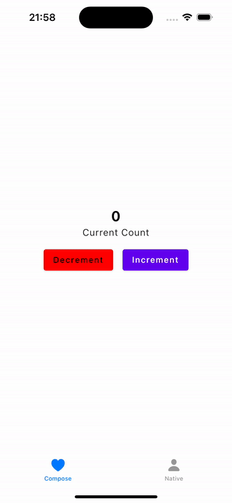

# Experiment: Observing ViewModel state on SwiftUI

This experiment consists on building a way to observe the ViewModel state in a transparent way both for Kotlin and Swift.

To achieve that goal, we will make use of Compose Runtime in the ViewModel object. The main reason for that are:

1. It's transparent for Compose;
2. We need a "raw" property for consuming on Swift;
   * That's why we can't use Flows as it's a box around the real type

Here is the sample running on both Compose and SwiftUI, using the same ViewModel:

Most of the code here is inspired by the [Hyperdrive](https://github.com/Brightify/Hyperdrive/) library. Some classes were just copied from there to experiment with them in a smaller scale.

## Sample project

To simulate it, I've created a sample counter screen with one observable property (count) and two actions that can be triggered by the user (inc/dec). The screen is really straight forward to focus on state management. 

* Shared ViewModel: [CountViewModel.kt](composeApp/src/commonMain/kotlin/vm/CountViewModel.kt)
* Shared UI in Compose MP: [Content.kt](composeApp/src/commonMain/kotlin/Content.kt)
* Native iOS Screen: [NativeContentView.swift](iosApp/iosApp/NativeContentView.swift)

## How does it work

Everything starts in the `ObservableObject` interface. All objects that will be observed in the swift side must inherit
from this. The important points here are:

1. It provides the `changeTracking` property that is called on Swift later to observe the state change (check [ObservedObject](#ObservedObject) section)
2. We provide the `BaseObservableObject` implementation that also provides the `changeTrackingTrigger`, which is responsible for triggering the "notifications";
3. We provide a `mutableStateOf` function that uses a wrapper type from us (check [ObservableMutableStateImpl](#ObservableMutableStateImpl) section)

### ObservableMutableStateImpl

File: [StateFlow.kt](lib/src/commonMain/kotlin/dev/valvassori/state/StateFlow.kt)

* This class implement the `MutableState<T>` interface;
* It has a property called `delegate` (that is the real state implementation from compose);
* It receives an extra argument in the constructor to trigger the state changes;
* In the override from `value`, we use the existing `policy` to check if the value has changed before calling the triggers;
* If the value is changing, we call the trigger to `willChange`, update the state in the delegate, then call the trigger o `didChange`;
  * With this, SwiftUI can check if the state has indeed changed and update UI

### ObservedObject

To properly use the `@ObservedObject` on Swift, we must make your type conform to the following two interfaces:

1. Combine.ObservableObject
2. Identifiable

Unfortunately, we can't create an extension to the `ObservableObject` interface inheriting from it (swift does not allow).
As an alternative, I've created the `ObservableViewModel` type that is a class and can receive the extension.

This extension uses the `changeTracking` property from `ObservableObject` to update when needed. This class (ideally) would be included in the project or maybe created by SKIE or something similar.

* [Observable.swift](iosApp/iosApp/Observable.swift)